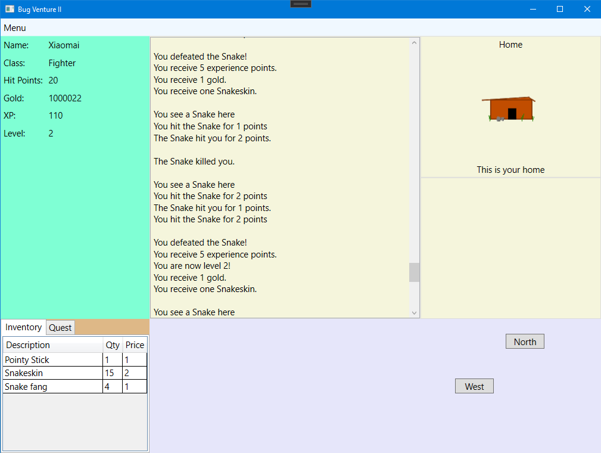

# BugVenture 2

> 核心架构非原创：学习对象：https://scottlilly.com/build-a-cwpf-rpg/
>
> Scott Lilly（原创）教学源码：[ScottLilly/SOSCSRPG: Scott's Open Source C# RPG (github.com)](https://github.com/ScottLilly/SOSCSRPG)

【游戏开发】纯UI游戏

【环境、技术】

- 集成环境：Visual Studio Community 2019
- C#（逻辑）、WPF（页面）

## 目前界面进度

## 游戏设计

### 最初计划

- [ ] 用户可以创建**角色**
  
  - [ ] 不同职业（每个职业有不同的加成）
  
- [x] **角色**可以在**地点**之间移动

- [x] 有些**地点**可能拥有可以战斗的**怪物**

- [x] 如果**角色**杀死**怪物**，可以获得
  
  - [x] 经验值、金币、随机**战利品**
  
- [x] 如果**角色**没有成功杀死**怪物**，
  - [x] 回家
  - [x] 完全恢复
  
- [x] 有些**地点**可能拥有**任务**
  - [x] 完成任务需要提交**道具**
    - [x] **道具**获得方法从怪物**战利品**
  - [x] 如果玩家拥有完成任务所需要的**道具**，且将**道具**送回接**任务**的**地点**，会获得
    - [x] 经验值、金币、奖励**道具**
  
- [x] 有些**地点**可能拥有**商人**
  
  - [x] **角色**可以买、卖**道具**
  
- [ ] 用户可以保存、加载游戏

**游戏地图规划**

### 后续更新

- [ ] 药水系统
- [ ] 合成系统

## 已知BUG

1. 25/2/2021 - 完成任务时，只消除一个任务要求道具 - 25/2/2021 - 已修复