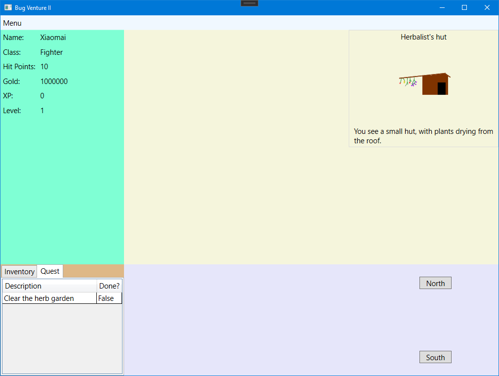
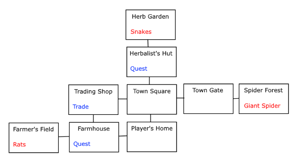

# BugVenture 2

> 核心架构非原创：学习对象：https://scottlilly.com/build-a-cwpf-rpg/
>
> Scott Lilly（原创）教学源码：[ScottLilly/SOSCSRPG: Scott's Open Source C# RPG (github.com)](https://github.com/ScottLilly/SOSCSRPG)

【游戏开发】纯UI游戏

【环境、技术】

- 集成环境：Visual Studio Community 2019
- C#（逻辑）、WPF（页面）

## 目前界面进度

## 游戏设计

- 用户可以创建**角色**
  - 不同职业（每个职业有不同的加成）
- **角色**可以在**地点**之间移动
- 有些**地点**可能拥有可以战斗的**怪物**
- 如果**角色**杀死**怪物**，可以获得
  - 经验值、金币、随机**战利品**
- 如果**角色**没有成功杀死**怪物**，
  - 回家
  - 完全恢复
- 有些**地点**可能拥有**任务**
  - 完成任务需要提交**道具**
    - **道具**获得方法从怪物**战利品**
  - 如果玩家拥有完成任务所需要的**道具**，且将**道具**送回接**任务**的**地点**，会获得
    - 经验值、金币、奖励**道具**
- 有些**地点**可能拥有**商人**
  - **角色**可以买、卖**道具**
- 用户可以保存、加载游戏

**游戏地图规划**

## 面向对象类

### 角色Player.cs

| 属性值                   | 数据类型 |
| ------------------------ | -------- |
| Name 名称                | string   |
| Class 职业               | string   |
| Hit Points 生命值        | int      |
| Experience Points 经验值 | int      |
| Level 等级               | int      |
| Gold 金币                | int      |

### 物品栏设计

| 物品详情 | 数量 |
| -------- | ---- |
|          |      |

### 任务栏设计

| 任务详情 | 是否完成 |
| -------- | -------- |
|          |          |

## 项目结构简介

### BugVentureEngine项目

1. Models文件夹 - 存放数据模型（角色、怪物、地点……）
   1. Player.cs : BaseNotificationClass 角色、玩家
   2. Location.cs 游戏位置（小地图）
   3. World.cs 游戏世界（大地图）
   4. GameItem.cs 游戏道具
   5. Weapon.cs : GameItem 武器
   6. ItemQuantity.cs 记录物品数量（比如提交任务所需的物品）
   7. Quest.cs 任务
   8. QuestStatus.cs 任务状态（是否完成）
2. ViewModels - 用于View和Model之间的媒介（项目逻辑）
   1. GameSession.cs : BaseNotificationClass
3. Factories - 用于创建游戏物品的“工厂”
   1. WorldFactory.cs 世界工厂 - 生成由小地图合并起来的大地图
   2. ItemFactory.cs 武器工厂
4. BaseNotificationClass : INotifyPropertyChanged 发送属性更改通知

### BugVentureUI项目

1. MainWindow.xaml 游戏的主窗口

## 补充说明（编程笔记）

**克隆物品Clone：**如果我们的武器可以进行附魔，那么每把武器（或道具）就需要有独立的属性。这时候就需要new新的道具实例，才能让每个道具拥有独立属性